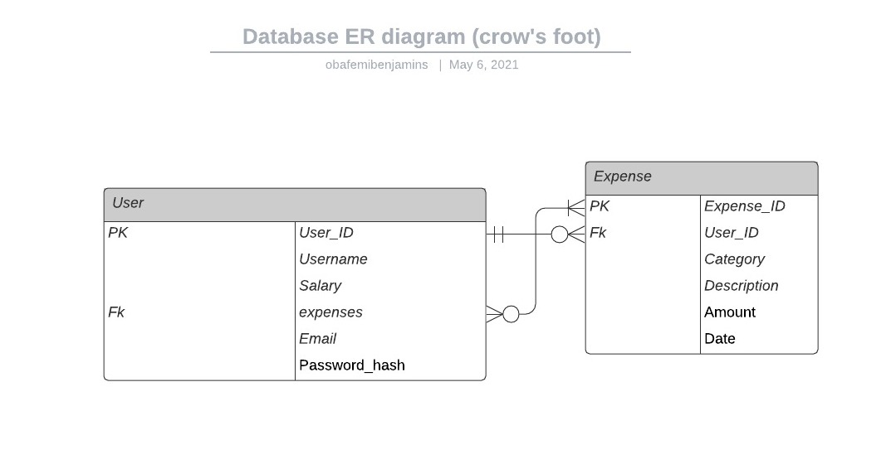

This is an expenditure tracking application that allows authentication, add, delete and edit Spendings. Also displays a graph and chart with your expenses.
>## Authors: 
[Benjamin Obafemi](https://github.com/benjaminbills/budgetapp)[El-rophi Skwaila](https://github.com/benjaminbills/budgetapp)

---

>## Description
### This is a simple expenditure tracking application that let's you keep a track of your expenses
---

## Technology Used: 
>Bootstrap

>Python

>Flask

---

>## Installation and setup locally
## Pre-requisites
- Python3
- Virtual environment
- bootstrap
- flask

---
>## Cloning and opening on compiler
#### On your terminal run

    $ git clone https://github.com/benjaminbills/budgetapp
    $ cd user-story
    $ code .

    ##  Setting up the virtual environment and activating it
    $ python -m venv <name of virtual environment>
    $ source <name of virtual environment>/bin/activate
    ##  Install flask and modules needed using requirements.txt
       $ pip3 freeze install -r requirements.txt

## Creating the start.sh file to tun the app
 - Create a file and name it start.sh
 - in the file add this

       export SECRET_KEY=<you api key>
       python3 manage.py server

## Run the app now
On your terminal run

        $ chmod +x start.sh
        $ ./start.sh

## Test the application

        $ python3 manage.py test

## ER DIAGRAM



## Code used sample
```python
from flask import Flask
from flask_sqlalchemy import SQLAlchemy
from flask_bcrypt import Bcrypt
from flask_login import LoginManager


app = Flask(__name__)


app.config['SECRET_KEY'] = "9ebb252dc447cf82fb0490410ab36c2a"
app.config['SQLALCHEMY_DATABASE_URI'] = 'sqlite:///blog.db'
db = SQLAlchemy(app)
bcrypt = Bcrypt(app)
login_manager = LoginManager(app)
login_manager.login_view = 'login'
login_manager.login_message_category= 'info'


from app import views

``` 

### Email: Elrophi@gmail.com and obafemibenjamins@gmail.com
### Contact: 0700 000 000

### Copyright and License
[MIT License](https://github.com/Elrophi/flask-quote/blob/master/LICENSE)